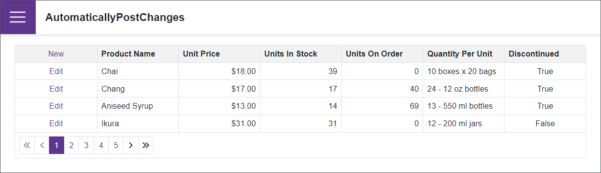

# Grid for Blazor - How to automatically post changes to a bound data source

When a users completes editing a row in the [DxGrid](https://docs.devexpress.com/Blazor/DevExpress.Blazor.DxGrid), it is necessary to save the changes to the bound data source. This example demonstrates how to use the [AutoMapper](https://github.com/AutoMapper/AutoMapper) library to automaticaly save changes in the in-memory object and not copy each property value mannually.

## Files to Look At

- [Index.razor](./CS/AutomaticallyPostChanges/Pages/Index.razor)
- [Index.razor](./CS/AutomaticallyPostChanges/Data/Northwind/EditableProduct.cs)
- [Index.razor](./CS/AutomaticallyPostChanges/Data/Northwind/Product.cs)

## Documentation

- [Grid: Bind to Data](https://docs.devexpress.com/Blazor/403737/grid/bind-to-data)
- [Grid: Edit Data and Validate Input](https://docs.devexpress.com/Blazor/403454/grid/edit-data-and-validate-input)

## More Examples

- [Blazor Grid - Inline Editing and Cell Edit Templates](https://github.com/DevExpress-Examples/blazor-grid-row-editing)